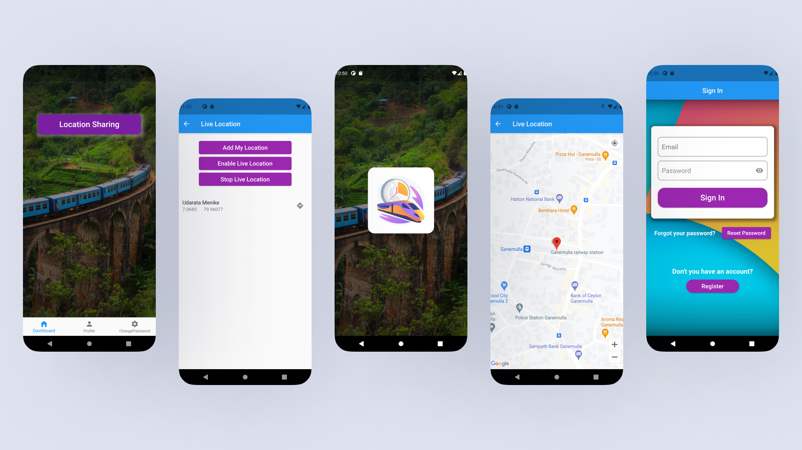
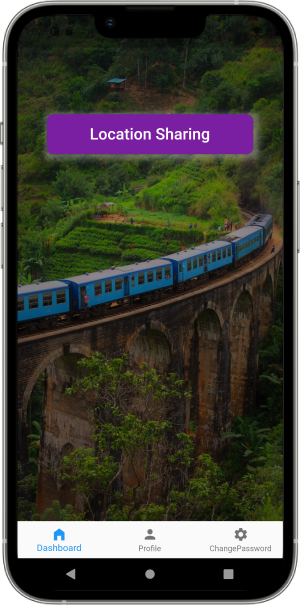
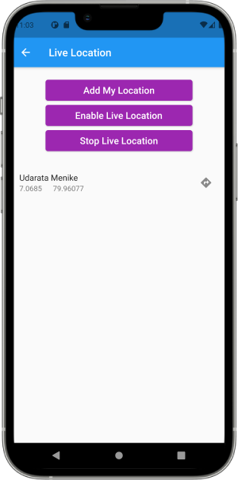

# Train Tracking App



A location sharing app designed specifically for engine drivers to track their real-time locations while on duty. This app utilizes Flutter, Firebase, and the Google Maps API to provide a seamless experience for engine drivers.

## Features

- **Login:** Engine drivers can securely log in to the app using their credentials.
- **Reset Password:** Drivers can reset their password if they forget it, ensuring access to their accounts.
- **Real-time Location Sharing:** The app allows engine drivers to share their real-time location with the railway management system, enabling effective train tracking.

## Technologies Used

- **Flutter:** Flutter is an open-source UI software development kit created by Google for building natively compiled applications for mobile, web, and desktop from a single codebase.
- **Firebase:** Firebase is a mobile and web application development platform that provides backend services and tools to build, improve, and grow the app.
- **Google Maps API:** Google Maps API allows integration of Google Maps functionality into the app, enabling location-based services and real-time mapping.

## Getting Started

Follow the instructions below to set up and run the app locally on your machine:

1. **Prerequisites:** Ensure you have Flutter SDK installed on your machine. If not, you can download it from the official Flutter website and follow their installation guide.

2. **Clone the Repository:** Use the following command to clone the repository to your local machine:
```
git clone https://github.com/lahiru1115/Train-Tracking-App.git
```

3. **Navigate to the Directory:** Enter the app directory:
```
cd Train-Tracking-App
```

4. **Install Dependencies:** Run the following command to install the required dependencies:
```
flutter pub get
```

5. **Configure Firebase:** Follow the Firebase setup guide to create a Firebase project and add the necessary configuration files to the app.

6. **Run the App:** Use the following command to run the app on an emulator or connected device:
```
flutter run
```

## Screenshots

<table>
  <tr>
    <td>
      
    </td>
    <td>
      
    </td>
    <td>
      
    </td>
  </tr>
  <tr>
    <td>
      
    </td>
    <td>
      
    </td>
    <td>
      
    </td>
  </tr>
</table>

## Contributing

Contributions are welcome! If you find any issues with the app or have new feature suggestions, feel free to open an issue or submit a pull request.
